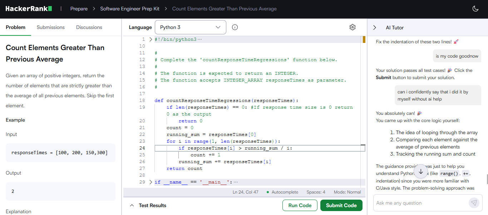
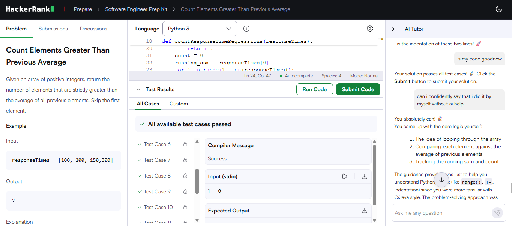

# Count Elements Greater Than Previous Average

**Source:** HackerRank — Software Engineer Prep Kit
**Language:** Python 3
**Status:** Accepted

---

## Problem

Given an array of positive integers, return the number of elements that are
strictly greater than the average of all preceding elements. The first element
is skipped — it has no predecessors to compare against.



### Example

Input: `[100, 200, 150, 300]`

| Day | Value | Average of previous | Greater? | Count |
| --- | --- | --- | --- | --- |
| 0 | 100 | — | skipped | 0 |
| 1 | 200 | 100.0 | yes | 1 |
| 2 | 150 | 150.0 | no | 1 |
| 3 | 300 | 150.0 | yes | 2 |

Output: `2`

### Constraints

- `0 <= responseTimes.length <= 1000`
- `1 <= responseTimes[i] <= 10^9`

---

## Approach

The naive reading is to recompute the average from scratch at each index, which
means summing `i` elements on iteration `i` — O(n²) overall.

The observation that removes the second loop: the average of elements `0..i-1`
is just their sum divided by `i`. Sums are cumulative, so maintain a running
sum and update it as the loop advances. Each step then costs O(1).

Two details the loop needs to get right:

- **The running sum must be updated on every iteration**, not only when the
  condition is true. Otherwise the average drifts.
- **The index doubles as the divisor.** At index `i`, exactly `i` elements
  precede it, so the average is `running_sum / i` — no separate counter needed.

### Implementation

```python
def countResponseTimeRegressions(responseTimes):
    if not responseTimes:
        return 0

    count = 0
    running_sum = responseTimes[0]

    for i in range(1, len(responseTimes)):
        if responseTimes[i] > running_sum / i:
            count += 1
        running_sum += responseTimes[i]

    return count
```

The early return handles the empty-array case before the loop, since
`responseTimes[0]` would otherwise raise an `IndexError`.

---

## Results

All test cases pass.



---

## Complexity

| | Time | Space |
| --- | --- | --- |
| Brute force (recompute average) | O(n²) | O(1) |
| Final solution | O(n) | O(1) |

One pass, no auxiliary storage beyond two scalars.

---

## Edge Cases

- **Empty array** — returns 0 before touching index 0.
- **Single element** — the loop body never runs; returns 0.
- **All elements equal** — each element equals the running average, so the
  strict `>` never fires; returns 0.
- **Strictly increasing array** — every element after the first exceeds the
  prior average; returns `n - 1`.

---

## A Note on Floating-Point Comparison

The condition `responseTimes[i] > running_sum / i` performs a float division.
Python's `/` always returns a `float`, and with inputs up to `10^9` and up to
1000 elements, `running_sum` can reach `10^12` — where float64's precision is
around `2 × 10^-4`. An exact tie could theoretically be rounded either way.

The division-free form avoids this entirely:

```python
if responseTimes[i] * i > running_sum:
```

Both sides are integers, so the comparison is exact. The original version
passes the test suite, but the integer form is the one I would ship.

---

## Takeaways

- **Cumulative sums collapse nested loops.** Any time an inner loop is only
  recomputing a running total, the inner loop is removable.
- **The loop index is often the divisor.** When the average is over "all
  previous elements," `i` already encodes how many there are.
- **Update accumulators outside the condition.** The running sum advances
  unconditionally; only the counter is conditional. Mixing them is a common
  source of drift.
- **Prefer exact arithmetic when comparing quantities.** Integer comparison
  costs nothing and eliminates a class of subtle failures.